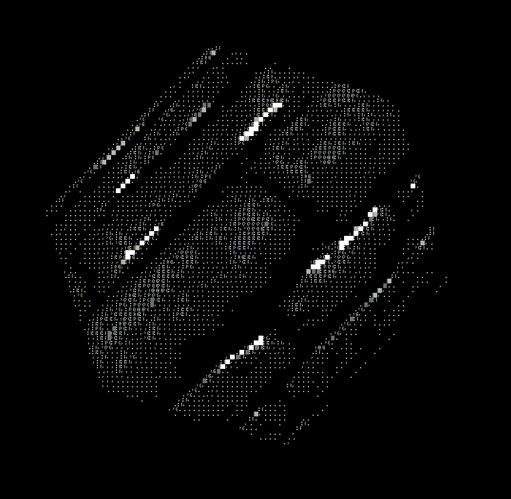

# 

## General
  - Wasm support.

## Editor
  - Make resources and assets viewable.
  - Make items in the world selectable, showing up in the right tab under `Inspector`.
  - Better Widget system that is not obtrusive, should implicitly not display Components/Resources/Assets without Widgets.
  - Persistent change.
  - Toml live editing with asset reloading.

## Particles
  - Investigate stuttering.

## Cereal
  - Support dynamic serialization and deserialization for components and resources (maybe?).
  - Reflect ...

## Math
  - General cleanup and full operator implementations for vectors.
  - Learn about Quaternions?

